# Csv Utils


## Setup

- simply clone this repo into the `comfyui/custom_nodes/` folder : 

```
git clone https://github.com/SanicsP/ComfyUI-CsvUtils.git
```

- restart ComfyUI

- Nodes have no external dependencies, no need for the manager, the built-in python csv library is simply used

## Prompt Nodes 

These nodes allow you to easily manage positive and negative prompts, they are designed for simplicity, they are effective if you want to test models with several batches of positive and negative prompts independently of other parameters like: cfg, steps, resolution etc. It is still possible to manipulate more complex csv tables with the advanced nodes.
----
#### CSVPromptSaver

This node allows you to save negative and positive prompts in a csv file of your choice, you do not need to run the workflow for the save to be done, you just need to press the button

##### Result  : 


#### CSVPromptLoader

This node allows you to easily load your positive and negative prompts from a csv file by specifying the row you want. The loading is done during the workflow execution. This node is useful if you want to automatically execute multiple prompts from a csv table

##### example : 

So at each execution of the workflow the value of the row will increment until the end of the csv table, you can then queue your several executions in a chain.

#### CSVPromptSearch


This mode directly displays the contents of your csv file as a simple list, with positive prompts on the left and negative prompts on the right. You can copy prompts by clicking directly on them. It also has a built-in quick and smart search to sort prompts if you have a large collection.


## Advanced Nodes 
These nodes are more advanced, they allow you to manipulate any csv file so you are not limited to negative or positive prompts, you can add as many columns as possible and name them as you want.


### Load a File

In case you are creating a new csv file you will need to perform these actions before you can use them in comfyui

Create a new csv file with the editor of your choice that supports the format


Open the file in your editor


You should have a blank board


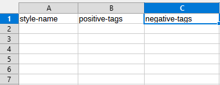

Fill the first row with as many fields as you want, these fields are important they will serve as headers for the nodes, and you will have to use them so that they can find the exact data you want. Although you are not obliged I strongly advise you to use simple strings for your columns like: `lora-name` , `TriggerWorlds` , `lora_tags`.... and not `Lora name` , `trigger worlds` , because it is easier to remember them. For this example I will make a csv file which contains different styles injectable in prompts. `style-name` corresponds to the name of the styles, ex: `realistic` , `anime` , `3d`; `positive-tags` and `negative-tags` correspond to the keywords to inject in the negative and positive prompts.


### IMPORTANT
Some editors use other separators like `|`, `\t`, or `spaces` for csv files. Make sure the editor uses commas (`,`) as a separator, otherwise there will be conflicts when loading/saving files because nodes only support commas as separators. If you have a csv file that has other separators, there are ways to convert the file.

Also, when using comfyui, make sure to close your editor to avoid file access conflicts , this could cause strange behavior like adding empty rows or corrupting your file.

### Add rows
If you want to add rows from comfyui you will need to use this node :

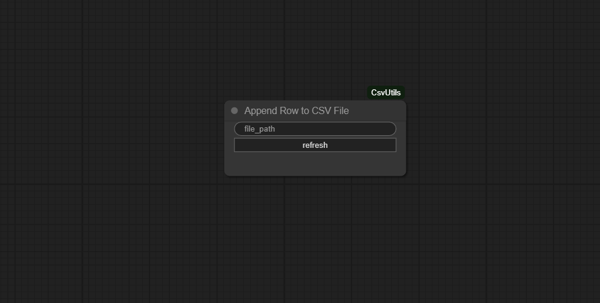

Enter the path to your csv file and press the refresh button, normally the node should add entries corresponding to the headers of your file :

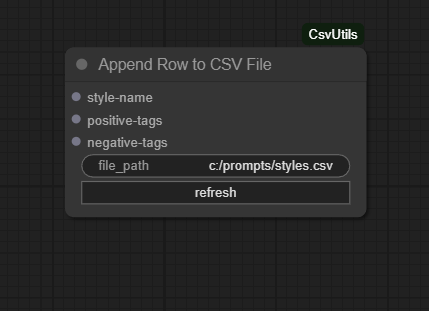

Connect the entries with what you want to add in the row

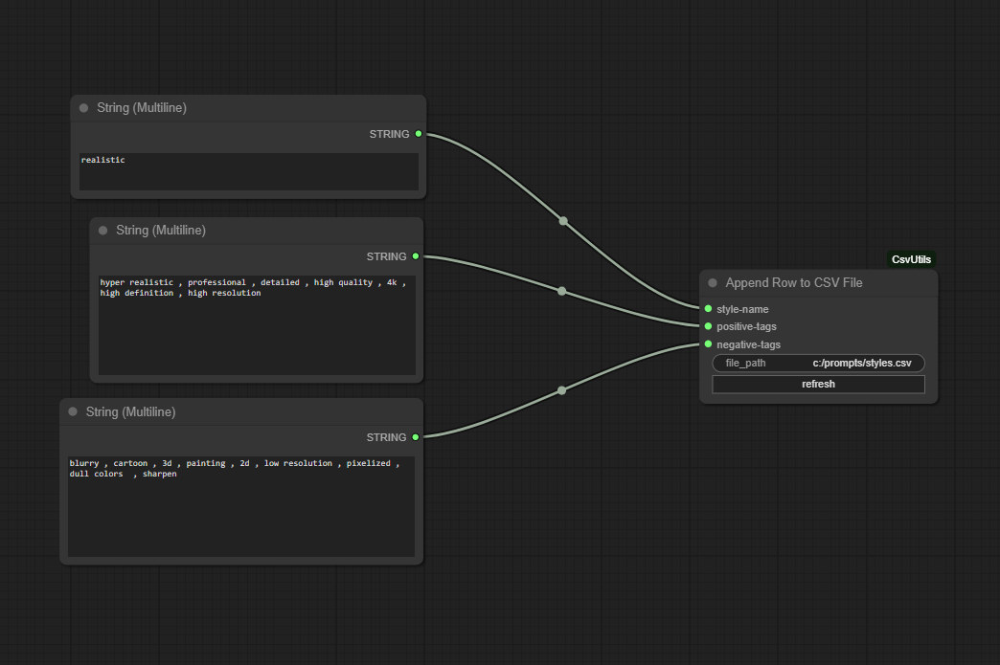

Run the workflow to add the row to the file

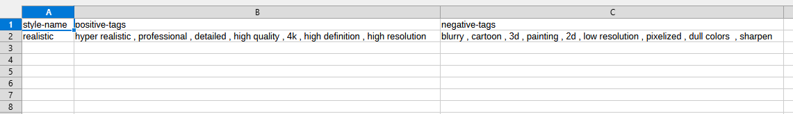

You can see in the editor that the row has been added

### Read Files

There are several ways to get csv data with this node pack, the easiest way is to use the generic version of the search node for prompts:

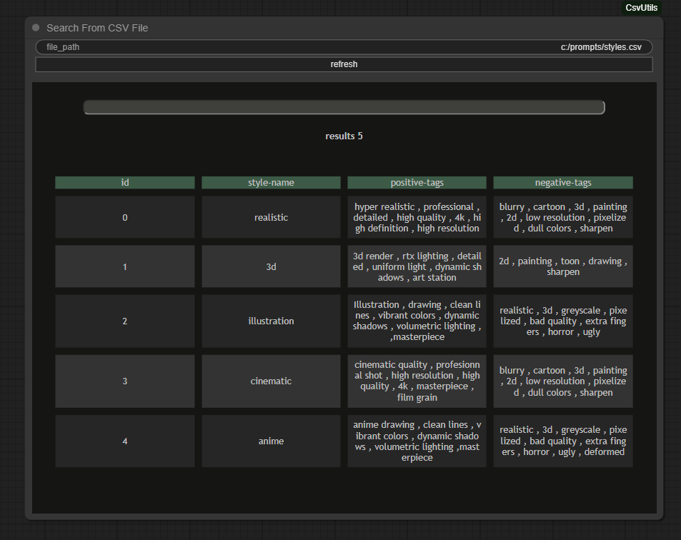

It works like the one for prompts but with any csv file

This node is very efficient, it allows you not only to have a preview of your file without leaving your browser/window but also to sort your results with the search bar. In addition, this node will not cause any access conflict problems because it loads the file only when necessary and closes it immediately, I advise you to have this node near you because it also allows you to find your way around efficiently and easily find the name of the headers, which will be useful for more advanced nodes.

now we will see the nodes that allow you to manipulate csv files more efficiently, first of all you will always need this node : 

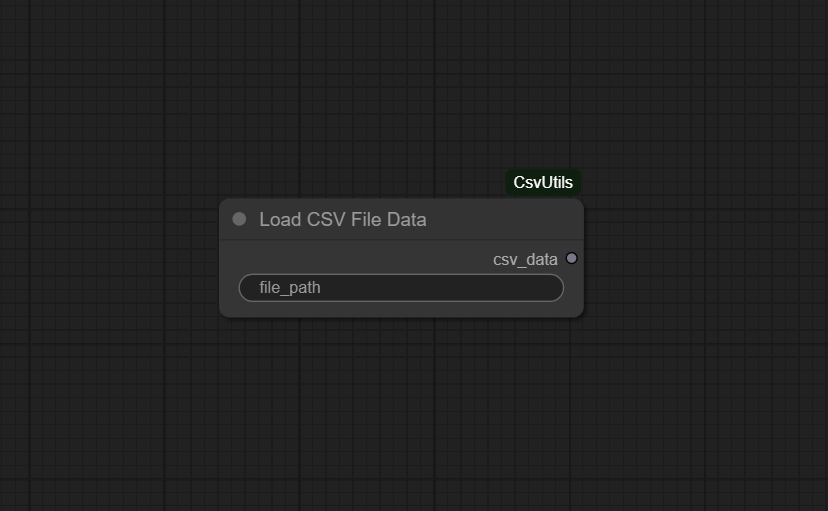

it loads the contents of the csv file of your choice and returns a table of rows that will be useful for the rest:

example output : 

```py
{
    "fieldnames" : ["style-name" , "positive-tags" , "negative-tags"] , 

    "rows" : [
        {"style-name" : "my style" , "positive-tags" : "some , tags" , "negative-tags" : "some , negative , tags"} , 
        # some rows ...
        {"style-name" : "another style" , "positive-tags"  : "other tags", "negative-tags" : "other negative tags"}
    ] , 

    # other data ....
}
```

There are several ways to select a row of your choice.

You can select a row by its index using this node:

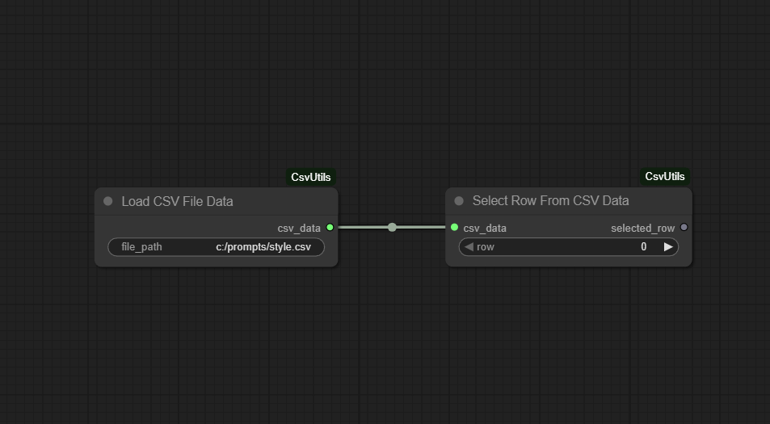

in our example selected row will return the first row of the table: 

```py 

{
    "style-name" : "realistic" , 
    
    "positive-tags" : "hyper realistic , professional , detailed , high quality , 4k , high definition , high resolution" , 
    
    "negative-tags" : "blurry , cartoon , 3d , painting , 2d , low resolution , pixelized , dull colors , sharpen"
}

```

This node is useful if you want to iterate over multiple rows.

You can also get a row by search, for example I want to get the row of the 3d style, I use this node:

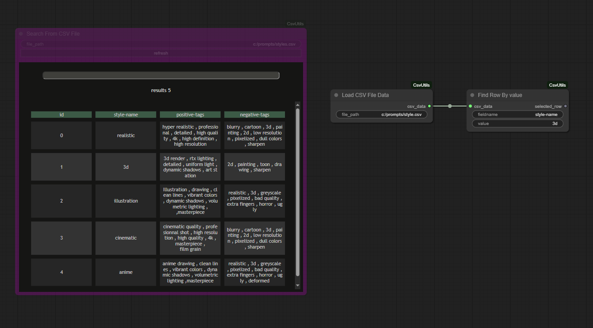

I will then get the second row with id 1 , this node is useful if you have a file with pressets

Now we need to select the value we want from the row we obtained :

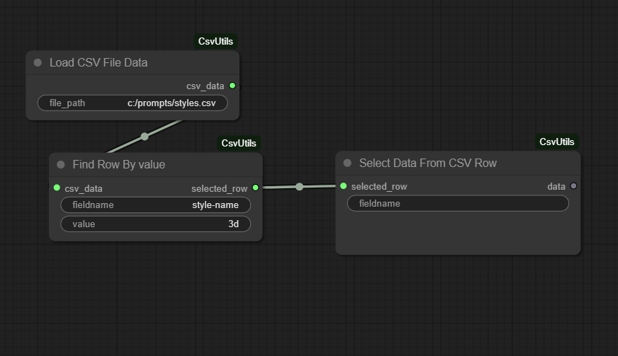

This node selects a value from the row based on the header name, for example if I want to retrieve the positive tags for ls style 3d then I should put `positive-tags` as a parameter of the node.

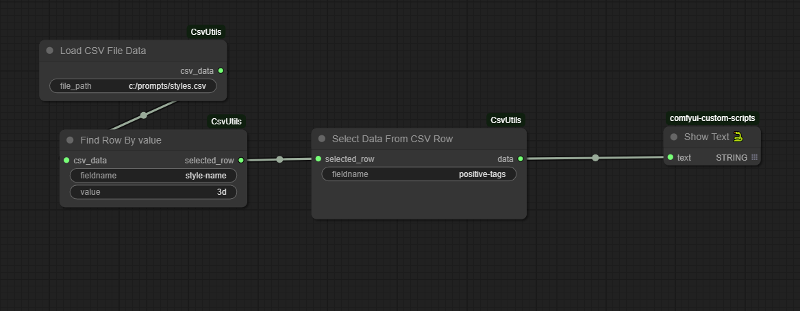

I would get this result :

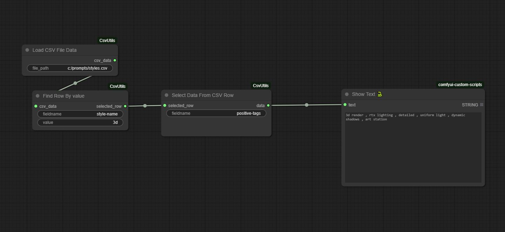

You can also use a node to select a value from the row relative to its column position:

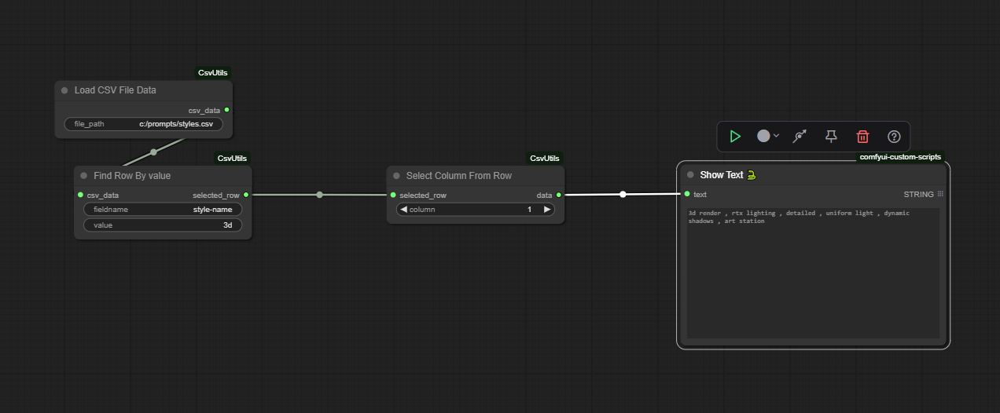

There is another simpler knot but with several drawbacks :

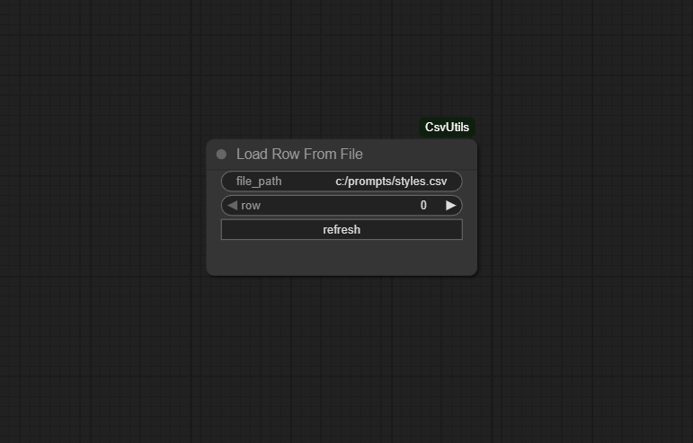

This node is easier to understand and less confusing, but you can only load one file at a time, or several different files with the same number of columns. You will have to constantly update the node: each time the page refreshes or you reload the workflow. The node is still simpler and less complicated.

Press refresh to refresh the node output, it will display the header names as with the append row node:

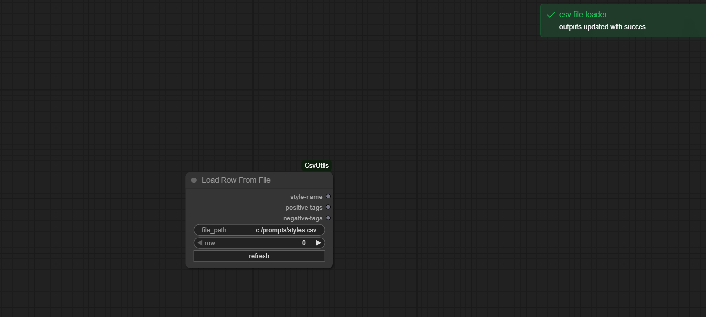

You can then choose the row you want

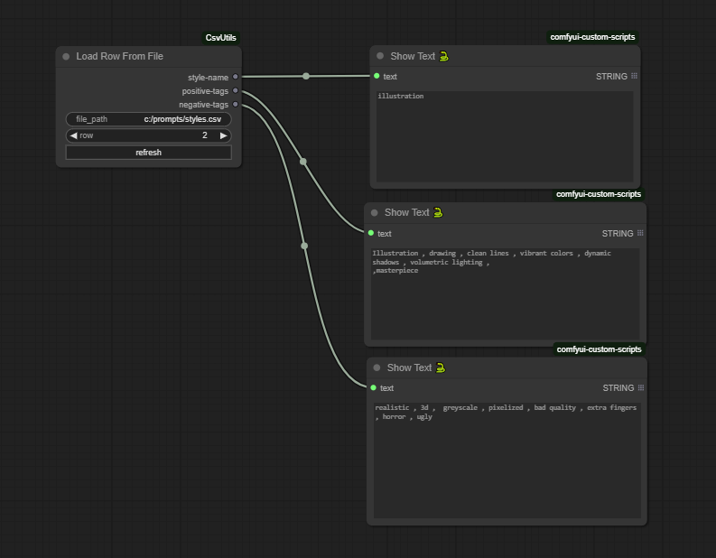


### Example

I want to test several styles on the same prompt, I can iterate over several rows to do tests :

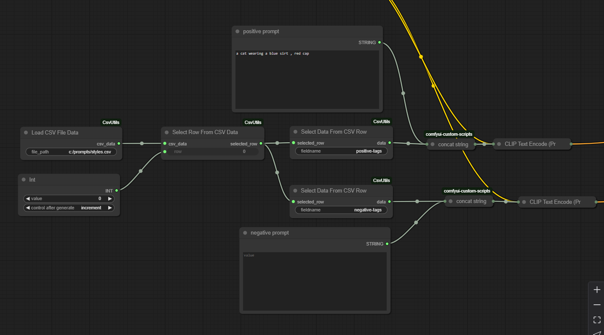

#### Results : 
Images generated with flux dev 1 : 


# Thanks

I used the [MiniSearch](https://github.com/lucaong/minisearch) js library to make indexing and searching prompts faster

Please feel free to make suggestions.

If you encounter any problems, please feel free to open issues in the github.